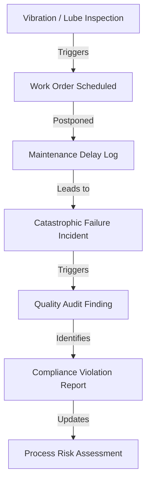

# PlantMind Industrial Dataset Generator

The **PlantMind Industrial Dataset Generator** is a Python application designed to generate a realistic, synthetic industrial document repository and equipment image dataset for an integrated steel manufacturing plant. 

The generated dataset is specifically structured for validating and training AI solutions in **OCR Testing, Retrieval-Augmented Generation (RAG), Vector Search, Knowledge Graphs, Root Cause Analysis (RCA), and Compliance Auditing**.

---

## 🏗️ Plant Profile: SteelForge Industries Pvt Ltd
* **Location:** Hosur, Tamil Nadu, India
* **Industry:** Integrated Steel Manufacturing Plant
* **Capacity:** 1.2 Million Tonnes Per Year (MTPY)
* **Assets:** 30+ physical assets (boilers, centrifugal pumps, heat exchangers, valves, motors, etc.)
* **Workforce:** 50+ personnel (operators, engineers, auditors, safety officers, supervisors)

---

## 🛠️ Technology Stack
* **Python 3.10+**
* **reportlab** (for generating high-fidelity PDF documents with structured tables, approval sections, running headers, and footers)
* **python-docx** (for generating matching structured DOCX documents)
* **faker** (for generating realistic Indian personnel names, emails, phones, and metadata)
* **Pillow** (for generating schematic equipment drawings for OCR testing)
* **Standard libraries:** `random`, `datetime`, `json`, `pathlib`

---

## 📁 Repository Structure
Running the generator will create the following output directory structure under `output/`:

```
output/
├── Equipment/           # Registers (Asset Register, Equipment Register)
├── OEM_Manuals/         # OEM Original Manuals (operation limits, design spec sheets)
├── Maintenance/         # PM / breakdown reports, Lubrication records
├── Incidents/           # RCA reports, 5-Whys analysis sheets
├── Inspection/          # General inspection logs, Vibration reports
├── SOP/                 # Standard Operating Procedures
├── WorkOrders/          # Shift maintenance work orders
├── Audit/               # Internal quality and safety audits
├── Compliance/          # Regulatory gaps and corrective actions
├── Training/            # Personnel list and training certifications
├── ShiftLogs/           # Shift handover logs and Daily Operator Logs
├── Emails/              # Technical email threads between engineers
├── SpareParts/          # Inventory logs for critical spares
├── Calibration/         # Instrumentation tolerance calibration reports
├── RiskAssessment/      # Process Hazard (HAZOP) risk sheets
├── Images/              # Pillow-generated PNG schematics for OCR testing
├── PDF/                 # Category compiled PDF files
└── DOCX/                # Category compiled DOCX files
```

---

## ⚙️ Configuration & Customization
All generation rules and text fragments are stored in configuration files under `templates/`:
1. **[config.json](templates/config.json)**:
   * Edit this file to customize:
     * Company Name and Location.
     * Document Counts (e.g. increase count of Maintenance Reports, Work Orders).
     * Asset Count and Employee Count.
     * Timeline range (defaults to January 2022 to December 2026).
2. **[document_templates.json](templates/document_templates.json)**:
   * Holds the detailed descriptions, technical failure modes, root causes (5-Whys), and corrective actions for the 6 recurring failures. You can add or modify engineering templates here.

---

## 🔗 Cause-and-Effect Narrative Engine (Knowledge Graph)
The generator builds a cohesive narrative by linking documents chronologically and referentially. 



### 6 Configured Failure Scenarios
1. **Pump P-101 (Bearing wear)**: Stockout of SKF bearings leading to pump seizure and loss of Blast Furnace cooling.
2. **Pump P-198 (Seal leakage)**: Dripping gland seal packing resulting in manual material replacement errors and flooding of the pump pit.
3. **Boiler B-401 (Pressure fluctuations)**: Calibration tool certification delay leading to false control valve inputs and rolling mill blackout.
4. **Heat Exchanger HX-301 (Fouling)**: Billet production priorities overriding thermal descaling schedules resulting in downsteam picking line trip.
5. **Air Compressor C-701 (Oil contamination)**: Lack of SOP check causing open bypass valves, fouling desiccant lines, and reheat furnace shutdown.
6. **Valve V-203 (Seat erosion)**: Procurement price negotiation delays leading to emergency isolation failure and acid spill.

---

## 🚀 Running the Generator
Ensure you have installed the required python packages:
```bash
pip install reportlab python-docx faker pillow
```

Run the generator script:
```bash
python generate_dataset.py
```

The generation takes 1–3 minutes to complete. Statistics and total output counts are logged directly to the console. All documents are written to the `output/` directory in both **PDF** and **DOCX** formats with matching IDs for easy validation.
